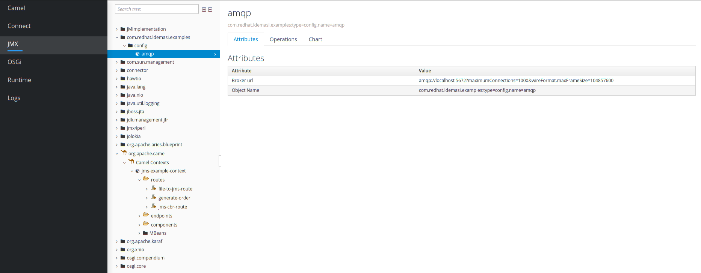
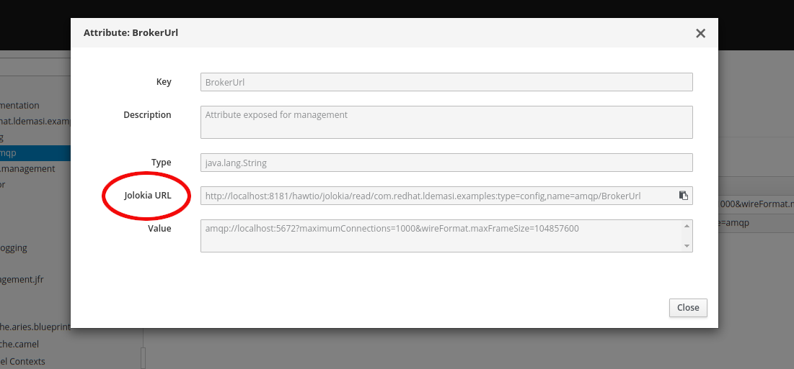

# Fuse Karaf Custom MBean Example

This example demonstrateshow to expose a custom MBean with Red Hat Fuse on Karaf using Apache JMX Whiteboard. 

### Prerequisites
* Maven
* A Red Hat Fuse server installed
* An instance of A-MQ server that expose an AMQP endpoint


### Running the example on Red Hat Fuse Standalone

##### Build the project
```bash
mvn clean install
```

#### Start fuse:

```bash
${KARAF_HOME}/bin/fuse clean
```

#### Deploy and start the bundle 

From Karaf shell:

```bash
karaf@root()> feature:install camel-amqp
karaf@root()> bundle:install -s mvn:com.redhat.ldemasi.examples/custom-mbean-example/1.0-SNAPSHOT
```

Access the Fuse console at http://localhost:8181/hawtio, go to the JMX tab and you'll see the Mbean exposed
under com.redhat.ldemasi.examples.config.amqp: 



You can retrieve the jolokia url clicking on the attribute:


